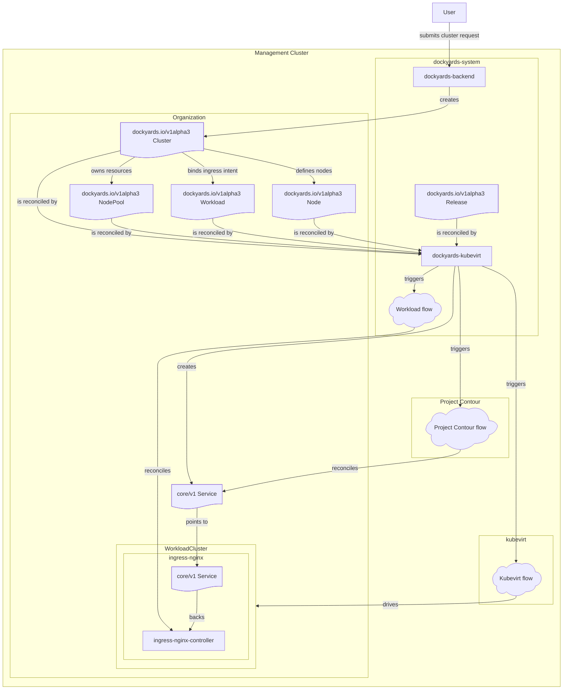

# Dockyards KubeVirt Operator

`dockyards-kubevirt` bridges the Dockyards backend with a KubeVirt/Talos provisioning stack. It watches all of the Dockyards CRs (Cluster, NodePool, Release, Workload, Node, Organization) that describe a customer environment and reconciles the matching Cluster API, Talos, and Gateway API resources so a workload cluster becomes reachable through the shared Gateway.

## Component diagram



The diagram highlights how the operator turns Dockyards CRs into Cluster API/KubeVirt/Talos artifacts, mirrors load balancer state from the remote workload cluster through a cluster cache, and wires the shared Gateway to the resulting services.

To keep the diagram compact, flow nodes aggregate the work that would otherwise span many edges:
- **Kubevirt Flow** bundles the node pool provisioning path: every `DockyardsNodePoolReconciler` call produces `KubevirtCluster`, `KubevirtMachineTemplate`, `TalosControlPlane`, `TalosConfigTemplate`, and `MachineDeployment` resources (plus the CDI-backed DataVolume/DataSource assets) for each node pool.
- **Workload Flow** abstracts the `DockyardsWorkloadReconciler` choreography that mirrors remote workload cluster services via `ClusterCache`, creates/patches the management-cluster `core/v1 Service`, and publishes HTTP/TLS routes to the shared gateway.
- **Project Contour Flow** groups the gateway-side wiring (the `ClusterGatewayService` plus the Project Contour DaemonSet/Ingress components) that front the workload services for users.

## Architecture context

### Management cluster orchestration
`dockyards-kubevirt` runs inside `dockyards-system` alongside `dockyards-backend` and watches every Dockyards resource that defines a customer environment. The reconcilers perform distinct roles:
- **`DockyardsClusterReconciler`** adds the shared gateway as the API and ingress anchor so the Dockyards cluster status always reports a reachable endpoint.
- **`DockyardsNodePoolReconciler`** bootstraps the KubeVirt/Talos templates for each node pool, wiring the appropriate machine templates, Talos configurations, and machine deployments.
- **`DockyardsReleaseReconciler`** downloads Talos installers, stores them in CDI `DataVolume`s, and publishes the downstream `DataSource` artifacts.
- **`DockyardsWorkloadReconciler`** owns the management-cluster `Service`, `HTTPRoute`, and `TLSRoute` objects, keeping gateway hostnames aligned with the Dockyards cluster DNS zones.
- **`DockyardsNodeReconciler`** mirrors node capacity totals (CPU, memory, storage) from the KubeVirt machines back into the Dockyards API nodes.
- **`DockyardsOrganizationReconciler`** marks organizations ready for onboarding once automation successfully observes them.

### KubeVirt and Talos provisioning
The controller stack keeps the KubeVirt and Talos artifacts aligned with the Dockyards cluster and node pool specs:
- The Cluster API cluster watcher ensures a `KubevirtCluster` infrastructure reference exists for each Dockyards cluster so the provider stack owns the control plane.
- The node pool reconciler maintains `KubevirtMachineTemplate`, `TalosControlPlane`, `TalosConfigTemplate`, and `MachineDeployment` templates in sync with the node pool spec, release images, and shared config patches (Multus, custom node IPs, etc.).
- The release reconcilier creates/updates a CDI `DataVolume` and downstream `DataSource` that hold the latest Talos installer payload.
- The node reconciler reads each `KubevirtMachine` to publish resource totals back into the Dockyards nodes.

### Workload ingress and Gateway API integration
`DockyardsWorkloadReconciler` grants the shared gateway the HTTP/TLS routes and core/v1 services that front a workload cluster service. It uses `clustercache.ClusterCache` to watch the remote services that the workload cluster creates and patches their LoadBalancer IPs so that the management cluster service status always advertises the gateway address. Once the gateway has an address the reconciler builds HTTPRoute/TLSRoute objects that advertise every customer DNS zone recorded on the owning Dockyards cluster, keeping the gateway in sync with the workload for both HTTP and TLS traffic.

## Key components
- **`ClusterAPIClusterReconciler`** (`controllers/clusterapicluster_controller.go`) keeps a `KubevirtCluster` in sync with every CAPI `Cluster` and populates `Cluster.Spec.InfrastructureRef` so that the provider stack owns the cluster.
- **`DockyardsNodePoolReconciler`** (`controllers/dockyardsnodepool_controller.go`) ensures `KubevirtMachineTemplate`, Talos control/worker templates, and `MachineDeployment` objects match the `NodePool` spec, wiring releases, storage classes, config patches, and NodePool conditions so Talos can bring up control plane and worker replicas.
- **`DockyardsReleaseReconciler`** (`controllers/dockyardsrelease_controller.go`) watches Talos releases, downloads the installer into a CDI `DataVolume`, creates a `DataSource`, and gives the data source creator RBAC so the Talos bootstrap can access the payload.
- **`DockyardsWorkloadReconciler`** (`controllers/dockyardsworkload_controller.go`) mirrors the workload cluster services into the management cluster, patches their LoadBalancer statuses through `ClusterCache`, and owns the HTTPRoute/TLSRoute objects that bind them to the gateway.
- **`DockyardsNodeReconciler`** (`controllers/dockyardsnode_controller.go`) reads `KubevirtMachine` templates to update the Dockyards node resource with current CPU/Memory/Storage totals.
- **`DockyardsOrganizationReconciler`** (`controllers/dockyardsorganization_controller.go`) flips the `Ready` condition once automation observes an organization that can be auto-assigned.

## Requirements

- Go 1.25+ and controller-runtime tooling (already captured by `go.mod`).
- A management cluster with the Dockyards CRDs, CDI, KubeVirt, Talos providers, Gateway API, and the shared gateway installed.
- Access to Talos release metadata in the Dockyards namespace so the release reconciler can keep the installer data volume up to date.

## Development

```bash
go test ./...
go build ./...
```

`main.go` wires all reconcilers together, loads the Dockyards config map (`dockyards-system` by default), and starts the `clustercache.ClusterCache` that lets the workload reconcilier observe remote services.

## Deployment

1. Build/push `dockyards-kubevirt` and update the OCI repository referenced by the Dockyards installer (`dockyardsctl` already points to `public.ecr.aws/sudosweden/dockyards-kubevirt`).
2. Deploy the controller into a cluster where `dockyards-system` hosts the Dockyards CRDs, Gateway, Talos providers, and the shared gateway; configure the CLI flags (`--config-map`, `--gateway-name`, `--gateway-namespace`, `--dockyards-namespace`, etc.) to match your installation.
3. Ensure the Talos release data sources and `NodePool` specs match the storage classes and networks you expose to KubeVirt so that machine templates and Talos configs can be generated automatically.

## Troubleshooting

- Check `dockyards-kubevirt` logs for errors reconciling Talos templates or the ClusterCache watcher failing to connect to a workload cluster.
- Confirm Gateway objects have an IPv4 address before the workload reconciler attempts to publish HTTP/TLS routes; missing addresses delay ingress readiness conditions.
- Verify that CDI `DataVolume`s created by the release reconciler succeed and expose a `DataSource` before the node pool reconcilers try to reference them.
